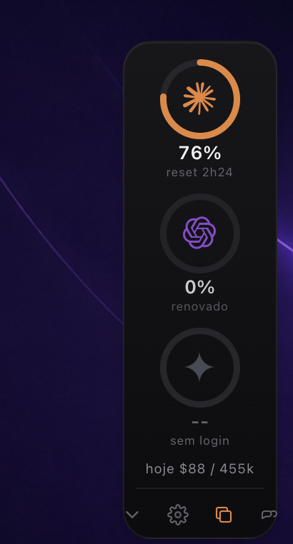
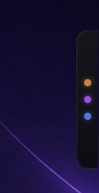

# OCA Copilot

A tiny macOS menu bar widget that shows, side by side, how much of each AI
coding assistant's rate limit you have burned: **Claude Code**, **Codex** and
**Gemini**, plus **OpenCode Go** quota when available. Four rings, live
percentages, and today's cost.

It sits as a discreet tab on the right edge of your screen. Click its arrow to
open it; hold the arrow to drag the tab vertically along that edge.

<p align="center">
  
  &nbsp;&nbsp;&nbsp;
  
</p>

> Built with [Tauri](https://tauri.app) (lightweight shell) + a small Node
> collector that reads local usage. No OCA server or telemetry; OpenCode Go
> quota requests go directly to OpenCode's official API.

## Features

- **Four provider rings** with used percentage when an official/local source exists.
- **Provider controls**: open the gear menu to choose which cards stay active.
- **Peek tab**: sized to active providers; click the arrow to open, or hold it
  to move the closed tab vertically along the screen edge.
- **Official logos**, colored per service.
- **Today's usage** line showing estimated cost and real work tokens
  (`hoje $71 / 328k`) instead of the raw, cache-inflated total.
- **Click a ring** to close the widget and open that assistant's CLI in Terminal
  when installed; otherwise it opens Terminal. Hover Codex or OpenCode to see
  available quota windows. OpenCode labels its rolling limit without assigning
  it a duration the API does not provide.
- **Exhausted state**: when an assistant hits its limit, its ring turns red and
  the icon dims.

## How it works

```
  ui/                front-end (HTML + CSS + inline SVG, no framework)
  src-collector/     collector.mjs: reads local usage and emits unified JSON
  src-tauri/         Tauri shell: menu bar tray, popover window, commands
  config.json        settings (refresh interval, budgets)
```

The front-end calls the Tauri command `get_usage`, which runs `collector.mjs`
and gets back one JSON object with the providers plus `dayTokens`.

## What the percentage means

| Agent | Data source | % = |
|-------|-------------|-----|
| **Claude** | `ccusage` (reads transcripts in `~/.claude/projects`) | tokens of the current 5h block vs a ceiling (budget from `config.json`, or your heaviest historical block) |
| **Codex** | session rollout in `~/.codex/sessions/.../rollout-*.jsonl` | `rate_limits.primary.used_percent`, Codex's **native** 5h-window number |
| **Gemini** | gemini-cli session JSON (after login) | day usage vs `gemini.dailyRequestBudget` (wired after login) |
| **OpenCode Go** | official `GET https://opencode.ai/zen/go/v1/usage` | API `usage.rolling.percent` (used %) |

Codex reports the number natively. Claude does not expose a local rate-limit
percentage, so we use a configurable proxy. Provider percentages describe
independent windows and do not add up to 100%.

OpenCode reads its credential from `~/.local/share/opencode/auth.json`, or
`$XDG_DATA_HOME/opencode/auth.json` when `XDG_DATA_HOME` is set. Only the
`opencode-go` API credential is eligible: the collector sends it directly to
the official Go usage endpoint and never includes it in frontend JSON, logs,
config, or another file. Credential file is read-only. API returns rolling,
weekly, and monthly `percent` values (used percentage) plus `resetsAt`; the
main ring uses rolling, while hovering the card shows all returned windows.
The response has no absolute quota or duration fields, so those are left
unknown. Other OpenCode providers/accounts have no supported official quota
endpoint and show “quota indisponível”, never an estimate. HTTP/API/auth errors
stay isolated from the other providers.

### About the "today" number

The raw daily token total is dominated by **cache reads** (Claude Code re-reads
the whole cached context every turn). Those count toward the total but cost a
fraction of a normal token. So the widget shows **estimated cost** plus **real
work tokens** (new input + generated output), not the inflated total.

## Requirements

- macOS
- [Node.js](https://nodejs.org) 18+
- [Rust](https://rustup.rs) (to build the app)
- The CLIs you want to monitor: `claude`, `codex`, and/or `@google/gemini-cli`
- Optional: [OpenCode](https://opencode.ai) CLI. Go quota requires OpenCode Go
  auth already present in its local `auth.json`.

## Build & install

```bash
npm install
npx tauri build
cp -R "src-tauri/target/release/bundle/macos/OCA Copilot.app" /Applications/
```

Launch it from Spotlight or Launchpad ("OCA Copilot"). It has no Dock icon; it
lives in the menu bar. Left-click the tray icon to show/hide, right-click for
the menu (Show/Hide, Quit).

For development: `npx tauri dev`.

## Configuration (`config.json`)

```json
{
  "refreshSeconds": 45,
  "openMode": "cli",
  "claude": { "enabled": true, "blockTokenBudget": null },
  "codex": { "enabled": true },
  "gemini": { "enabled": true, "dailyRequestBudget": 1000 },
  "opencode": { "enabled": true }
}
```

- The gear button opens the provider settings panel; switches save immediately.
- The settings panel can select `cli` (launch the installed provider CLI, with
  Terminal fallback) or `terminal` (open Terminal without starting the CLI).
- `refreshSeconds`: how often it refreshes (minimum 15s).
- `<provider>.enabled`: show/collect that provider; set `false` to turn it off
  in `config.json`, too.
  Missing fields default to `true`, so older config files keep working. Disabled
  providers are omitted from the widget; their local/API usage is not collected.
- `claude.blockTokenBudget`: token ceiling per 5h block for the %. `null`
  auto-calibrates from your heaviest block; set a number for a truer %.
- `gemini.dailyRequestBudget`: daily quota reference for Gemini's %.

## Gemini (pending)

The CLI installs via `@google/gemini-cli`, but the usage adapter is not wired
yet. Run `gemini` once to log in; until the adapter reads its session schema,
the third ring shows a dimmed `setup` state.

## OpenCode quota availability

Only OpenCode Go currently has an official quota endpoint supported here.
Other OpenCode auth providers still appear as unavailable because OpenCode
does not expose their quota through a supported API. Missing CLI/auth, invalid
auth JSON, non-Go credentials, timeout, network/API errors, and HTTP 401/403/
429 each produce an explicit unavailable state; Claude, Codex, and Gemini
collection continues. The request timeout is 12 seconds, with no retry loop.

## Notes on logos

The Claude, OpenAI and Google Gemini marks are trademarks of their respective
owners and are used here only to identify each service. Their SVGs come from
[Simple Icons](https://simpleicons.org). OpenCode icon comes from the
[OpenCode repository](https://github.com/anomalyco/opencode).

## License

MIT. See [LICENSE](LICENSE).
